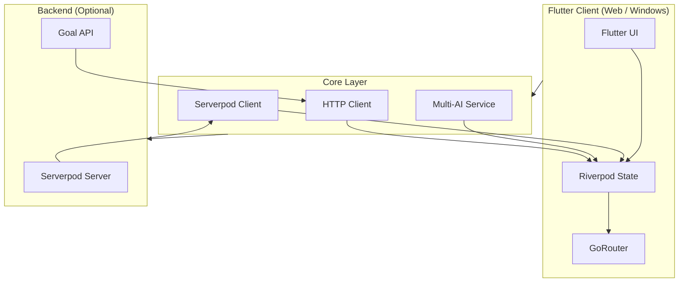
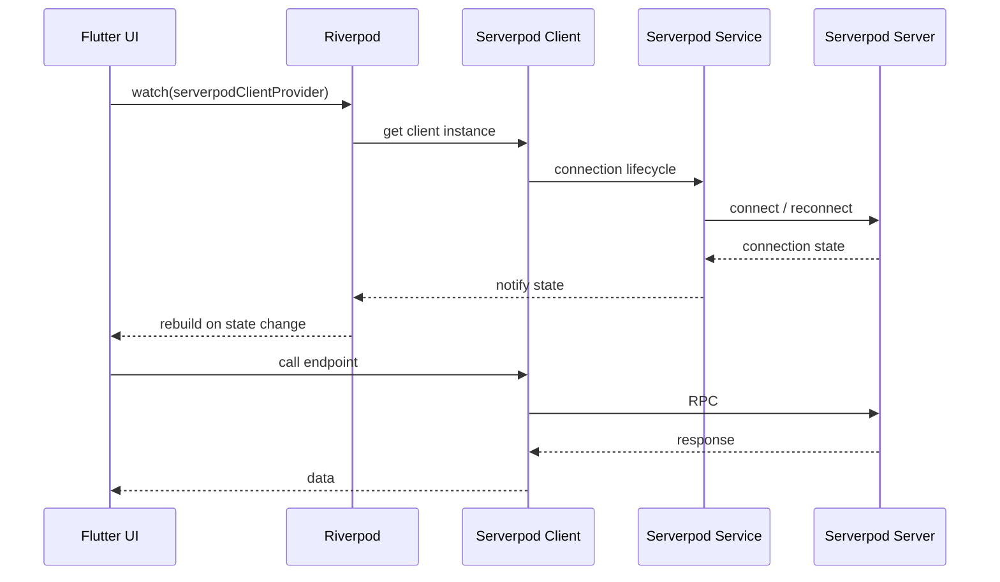
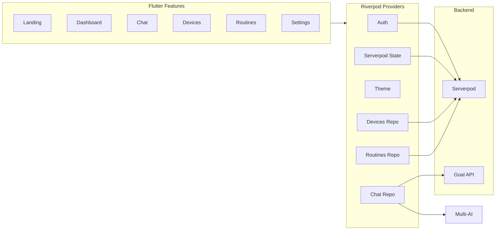
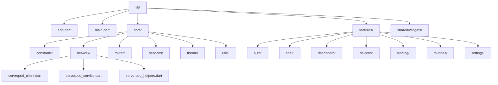
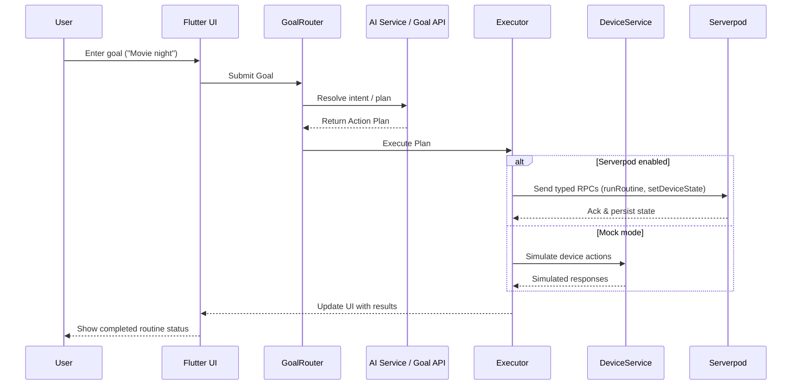
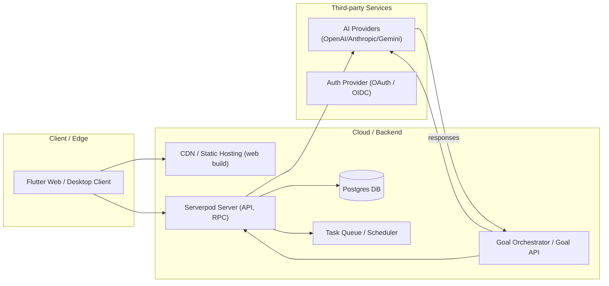

# A.U.R.A. (Adaptive, Unified, Responsive Assistant) — Flutter Serverpod Smart Home


## Project Overview

A.U.R.A. (Adaptive, Unified, Responsive Assistant) is a goal-oriented Flutter client that acts as a "Butler" for productivity and home automation tasks. Users express goals or requests in natural language (e.g. "Movie night", "Set up my morning routine", "Lower my thermostat") and A.U.R.A. orchestrates devices, schedules routines, and surfaces relevant UI and state to the user.


The codebase demonstrates a practical, production-minded Flutter app with modular layers, typed network bindings (Serverpod), Riverpod-based state management, and configurable AI integrations. 

---

## Key Features

* Natural-language goal input with intent routing (local AI / external Goal API / Serverpod RPC).
* Device discovery and state simulation (mock devices included for offline demos).
* Routine editor & one-tap routine execution.
* Persistent device & routine state (when Serverpod backend is configured).
* Multi-AI provider wrapper with fallback & mock modes for reliable demos.
* Clean, responsive UI built for web & desktop targets.
* Reconnection and error handling for networked backends.


---

## Architecture Overview



---

## Flutter ↔ Serverpod Integration



---

## Feature & Data Flow



---

## Tech Stack

| Layer | Technology |
|-------|------------|
| **UI** | Flutter — responsive layout, light/dark theme, shared components (app bar, bottom nav, glass containers) |
| **State** | Riverpod — auth, chat, routines, devices, theme, Serverpod client |
| **Backend** | Serverpod — client with connection state, reconnection, and generated RPC endpoints |
| **Routing** | GoRouter — declarative routes (landing, dashboard, chat, devices, routines, settings) |
| **AI** | Multi-AI service — single API over OpenAI, Anthropic, Gemini with fallback |

---

## What It Does

- **Goal-oriented chat** — Send goals to an optional backend (`AURA_BACKEND_URL` or **Serverpod** via `SERVERPOD_URL`; see `lib/core/network/SERVERPOD_AURA_API.md`) or use local AI (OpenAI/Anthropic/Gemini) or demo mock.
- **Smart home dashboard** — Devices, routines, and status at a glance.
- **Routines** — One-tap actions (e.g. “Lock all doors”, “Dim lights”, “Set thermostat to 68°F”).
- **Devices** — Browse and manage connected devices (Serverpod or your backend).
- **Serverpod-ready** — Backend wired with Riverpod providers, connection state, retry logic, and graceful degradation when Serverpod isn’t configured.

---

## Project Structure



| Path | Purpose |
|------|---------|
| `lib/app.dart` | Root `MaterialApp.router` and theme |
| `lib/core/` | Theme, env, router, HTTP client, **Serverpod client/service/helpers**, AI services |
| `lib/features/` | Auth, chat, dashboard, devices, landing, routines, settings |
| `lib/shared/widgets/` | Reusable UI (app bar, bottom nav, glass container, loading, etc.) |

Serverpod integration details: see **`lib/core/network/SERVERPOD_INTEGRATION.md`**.

---

## Requirements

- **Flutter SDK** (>=3.2.0)
- **Dart** 3.2+
- **(Optional)** Serverpod server project and generated client for full backend features
- **(Optional)** At least one AI API key (OpenAI, Anthropic, or Gemini) for live chat; otherwise demo/mock mode

---

## Getting Started

### 1. Clone and install

```bash
git clone <your-repo-url>
cd "aura flutter"
flutter pub get
```

### 2. Run (Chrome / Web)

```bash
flutter run -d chrome
```

Or on Windows PowerShell:

```powershell
.\run_chrome.ps1
```

The app runs without any keys. Chat uses **mock responses** until you set `AURA_BACKEND_URL` or add an AI API key.

### 3. (Optional) AI providers

Set at least one API key for real AI responses:

```bash
flutter run --dart-define=OPENAI_API_KEY=your_key
# or
flutter run --dart-define=ANTHROPIC_API_KEY=your_key
# or
flutter run --dart-define=GEMINI_API_KEY=your_key
```

Or copy `dart_defines.local.example` to `dart_defines.local`, add your keys, and run with `.\run_local.ps1` (do not commit `dart_defines.local`).

### 4. (Optional) Goal API backend

To send chat goals to an external orchestrator, set:

```bash
flutter run -d chrome --dart-define=AURA_BACKEND_URL=https://your-aura-api.example.com
```

With Bearer token:

```bash
flutter run -d chrome --dart-define=AURA_BACKEND_URL=https://... --dart-define=AURA_BACKEND_TOKEN=your_jwt_or_key
```

### 5. (Optional) Serverpod backend

1. Create a Serverpod server: `serverpod create aura_server`
2. Generate the client in the server project and add it to this app’s `pubspec.yaml`.
3. Configure the client in `lib/core/network/serverpod_client.dart` (see **`SERVERPOD_INTEGRATION.md`**).
4. Set the server URL:  
   `flutter run --dart-define=SERVERPOD_URL=https://your-server.com/`

### 6. Build for production (Web)

```bash
flutter build web
```

Serve the `build/web` output with any static host. Use the same `--dart-define=AURA_BACKEND_URL=...` (and optional `AURA_BACKEND_TOKEN`) when building if you use the goal API.


============================================================


# A.U.R.A. — Flutter Butler (Flutter + Serverpod)

**Your personal digital assistant built with Flutter on the front-end and Serverpod & AI services on the backend.**

This README is written for a hackathon audience: it explains architecture, technical implementation details, run instructions, testing, and — importantly — how to demo the project to align with judging criteria: **Innovation**, **Technical Execution & User Experience**, and **Impact**.

---

## Table of contents

* Project Overview
* Key Features
* What makes this innovative — (For Judges)
* Architecture & Design
* Technical choices & trade-offs
* Setup & Quickstart
* Environment variables & runtime modes
* Serverpod integration (optional)
* AI integrations & fallbacks
* Testing & CI
* Demo / Submission checklist (tailored to judging criteria)
* Screenshots / GIFs (placeholders)
* Contributing
* License

---

## What makes this innovative — (For Judges)

> Short version: This is not just a chatbot — it is a *goal-oriented orchestrator* that maps user intent to executable automations and device flows.

1. **Goal-first architecture**

   * The core abstraction is a *Goal* (a structured representation of what the user wants), not a sequence of chat messages. This enables automated composition of routines and safe execution planning.
2. **Hybrid execution model**

   * Goals can be resolved locally (mocked), forwarded to an external Goal API, or executed through typed Serverpod RPCs. This hybrid model enables reproducible hackathon demos and realistic server-driven execution.
3. **Type-safe backend integration**

   * When configured with Serverpod, the app uses generated Dart bindings so the client-server contract is strongly typed — reducing runtime parsing errors and enabling safer state persistence.
4. **AI-agnostic orchestration layer**

   * The AI layer is encapsulated behind a provider-agnostic service so you can swap OpenAI, Anthropic, Gemini, or internal models without rewriting business logic.
5. **Hack-friendly demo fallback**

   * Built-in mock mode and device simulators allow judges to experience the full feature set even when external API keys or hosted servers are unavailable.

This blend of practical engineering and flexible demoability is the innovation: real-world design decisions made to maximize technical correctness, reliability, and judge-friendly reproducibility.

---

## Architecture & Design (high-level)

* **Presentation**: Flutter + GoRouter, componentized widgets, responsive layout for desktop/web.
* **State**: Riverpod for scoped providers and async state management.
* **Networking**: HTTP client wrappers + Serverpod generated client when present.
* **AI & Orchestration**: Goal Router → AI Service / Goal API / Serverpod endpoint.
* **Persistence**: Optional Serverpod persistence for devices, routines, and user preferences.

---

### System Overview (diagram)

```mermaid
flowchart TB
  subgraph Client["Flutter Client (Web / Desktop)"]
    UI[Flutter UI
(GoRouter, Widgets)] --> State[Riverpod State]
    State --> SPClient[Serverpod Client]
    State --> AIService[AI Service]
    State --> HTTP[HTTP Client]
  end

  subgraph Backend["Backend / Cloud"]
    SPServer[Serverpod Server]
    GoalAPI[Goal API / Orchestrator]
    AIProviders[AI Providers
(OpenAI/Anthropic/Gemini)]
    DB[(Postgres / DB)]
  end

  subgraph Devices["Devices & Simulators"]
    Sim[Simulated Devices]
    IoT[IoT Devices / Smart Home]
  end

  UI -->|goal / intent| State
  State -->|rpc/http| SPServer
  State -->|goal request| GoalAPI
  GoalAPI --> AIProviders
  SPServer --> DB
  SPServer --> Devices
  Devices --> UI
```

---

### Goal flow (sequence diagram)



---

### Deployment diagram (components & infra)



---

### Key flows (text)

* **Goal submission**: UI -> GoalRouter -> (AI provider or Goal API) -> Action Plan -> Executor (local simulation or Serverpod RPCs).
* **Routine run**: UI -> RoutineService -> DeviceService -> Executor -> State update (and Serverpod persistence).

## Technical choices & trade-offs

* **Riverpod** chosen for predictable dependency injection and testability over a heavier Redux-style setup.
* **Serverpod** used for typed client/server bindings and fast Dart-first backend scaffolding; optional so hackathon participants can demo locally.
* **Multi-AI provider wrapper** eases testing and reduces vendor lock-in but increases integration surface.
* **Mock-first approach** ensures reliable demos (trade-off: some features require extra wiring when switching to production AI keys).

---

## Setup & Quickstart

**Prerequisites**

* Flutter SDK (3.x or later) and Dart 3.x
* (Optional) Serverpod CLI and Docker if you want to run a local server
* (Optional) API keys for AI providers (OpenAI / Anthropic / Gemini) if you want live AI

**Clone & run (mock/demo)**

```bash
git clone https://github.com/lucylow/flutter-butler-aura.git
cd flutter-butler-aura
flutter pub get
flutter run -d chrome
```

*This runs in mock mode by default (no external AI or Serverpod required).*

**Run with local Serverpod**

1. Scaffold a Serverpod server (see `serverpod create aura_server` in Serverpod docs).
2. Generate client bindings and add them as a path dependency or package.
3. Set `SERVERPOD_URL` when running the Flutter client:

```bash
flutter run -d chrome --dart-define=SERVERPOD_URL=https://localhost:8080/
```

**Run with AI provider (example: OpenAI)**

```bash
flutter run -d chrome --dart-define=OPENAI_API_KEY=sk_... \
  --dart-define=GEMINI_API_KEY=... --dart-define=AURA_BACKEND_URL=...
```

---

## Environment variables & runtime modes

The app accepts several `--dart-define` variables for runtime configuration. Consider placing them in a local `dart_defines.local` file (do not commit):

| Key                  | Purpose                               |
| -------------------- | ------------------------------------- |
| `OPENAI_API_KEY`     | OpenAI key (optional)                 |
| `ANTHROPIC_API_KEY`  | Anthropic key (optional)              |
| `GEMINI_API_KEY`     | Gemini / Google model key (optional)  |
| `AURA_BACKEND_URL`   | External Goal API base URL (optional) |
| `AURA_BACKEND_TOKEN` | Bearer token for Goal API (optional)  |
| `SERVERPOD_URL`      | Serverpod server base URL (optional)  |

**Runtime modes**

* `mock` — default, no external services required
* `ai` — uses configured AI keys
* `goal_api` — forwards goals to `AURA_BACKEND_URL`
* `serverpod` — uses generated Serverpod bindings and RPCs

---

## Serverpod integration (optional but recommended)

This repo is prepared for Serverpod integration for typed RPCs and persistence.

**Why use Serverpod**

* Type-safe client-server contract via generated Dart bindings
* Simple wiring for persistence, logging, and auth
* Easy to scaffold endpoints for devices, routines, and goal execution

**Integration steps (overview)**

1. Scaffold a `aura_server` Serverpod project using the Serverpod CLI.
2. Define your endpoints and protocol (devices, routines, goals) in the server project.
3. Run `serverpod generate` to produce the client packages.
4. Add the generated client package to this Flutter project (path dependency or published package).
5. Configure `SERVERPOD_URL` and instantiate the generated client in `lib/core/network/serverpod_client.dart`.

**Best practices**

* Keep tokens & secrets on the server; issue short-lived tokens to the client.
* Use the generated types for all RPC payloads to avoid manual JSON parsing.
* Add logging & telemetry for `Goal` execution paths to debug orchestrations.

---

## AI integrations & fallback strategy

A.U.R.A. supports multiple AI providers through an abstraction layer. The app intentionally includes a mock provider and a prioritized fallback strategy to keep demos stable.

**Provider priority (default)**

1. User-configured provider (OpenAI / Anthropic / Gemini)
2. Goal API (if `AURA_BACKEND_URL` provided)
3. Mock provider (fallback for demos)

**Developer tips**

* Validate API keys and show clear UI nudges when keys are missing.
* For reproducible demos, use the mock provider and note in the demo that it simulates the AI behavior.

---

## Testing & CI

* Unit and widget tests located under `test/` — run with `flutter test`.
* Linting and static analysis: `flutter analyze`.
* Suggested CI pipeline steps:

  1. `flutter analyze`
  2. `flutter test`
  3. `flutter build web` (to ensure build succeeds without missing defines)

---

## Demo / Submission checklist (Tailored to Judges)

This section maps features to the hackathon judging criteria so the judges see the project’s strengths clearly.

### Innovation — show this in demo

* Explain the *goal-first* design and show a non-trivial automation composed from a single goal (e.g. "Movie night" that dims lights, sets scene, and starts a playlist).
* Show how the system composes multiple actions automatically (Goal -> Plan -> Execute).
* Demonstrate swapping the execution mode (mock -> Goal API -> Serverpod) to highlight hybrid flexibility.

### Technical Execution & User Experience — show this in demo

* Open the client and show type-safety: trigger a Serverpod RPC and show the corresponding typed request in the server logs (if Serverpod is configured).
* Demonstrate reconnection logic and graceful error handling (turn off network and show client behavior, then reconnect).
* Show the Riverpod providers and one key unit test that verifies goal-to-plan translation.
* Highlight the UI polish: responsive layout, clear affordances for routines and devices.

### Impact — show this in demo

* Present a before/after scenario: manual sequence vs. one-goal automation and measure (or estimate) time saved.
* Use a concrete use-case (morning routine, movie night, or work focus mode) and show how tasks that previously required 3–5 taps are completed in 1.
* Describe accessibility or productivity improvements (e.g., quick voice/text goal entry, reusable routines).

**Recording tips**

* Keep demo 2–3 minutes. Start with a one-sentence problem statement, show the action, then show the architecture and code pointers quickly.
* Use the demo checklist to make sure each judging criterion has a visible demonstration.

---

## Screenshots / GIFs

*Placeholders — replace these with actual screenshots or an animated GIF showing a full goal lifecycle.*


---

## Repo pointers (important files)

* `lib/main.dart` — entrypoint
* `lib/app.dart` — app scaffold and GoRouter configuration
* `lib/core/network/serverpod_client.dart` — where Serverpod client wiring lives (if present)
* `lib/features/chat/` — goal input + chat components
* `lib/features/devices/` — device models & simulators
* `lib/features/routines/` — routine editor & executor
* `test/` — unit & widget tests
* `dart_defines.local.example` — example of local Dart defines (keys & endpoints)

---

## Contributing

1. Fork the repo
2. Create a topic branch `feat/<short-desc>` or `fix/<short-desc>`
3. Open a PR with a concise description and link to any related issue

Add unit tests for new logic (especially goal-to-plan transformation logic). Follow Dart & Flutter formatting rules.

---

## License

MIT — see the `LICENSE` file for full terms.

---

## Contact / Questions

For hackathon-related questions or access for judges, provide read access to the emails listed in the hackathon instructions or open an issue and tag `@lucylow`.
