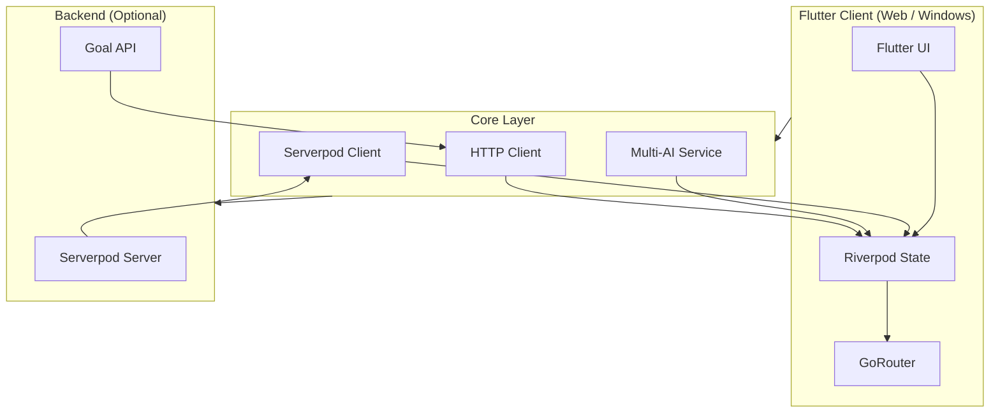
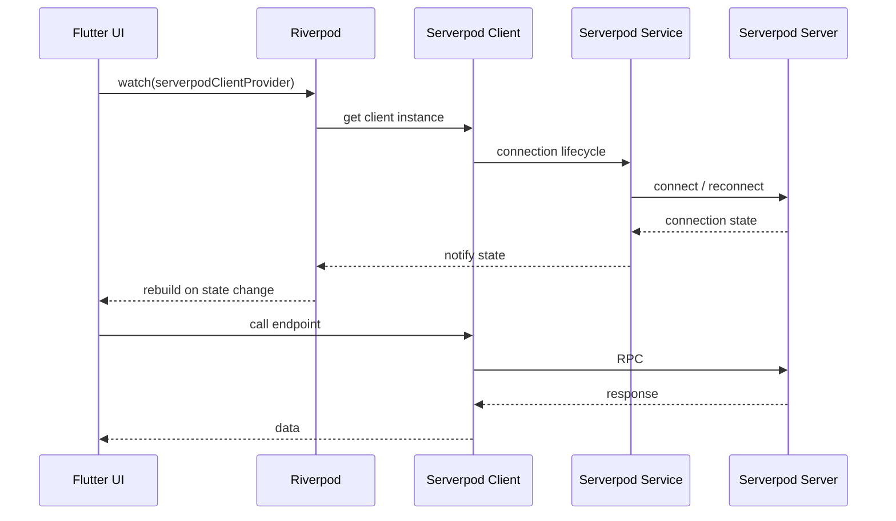
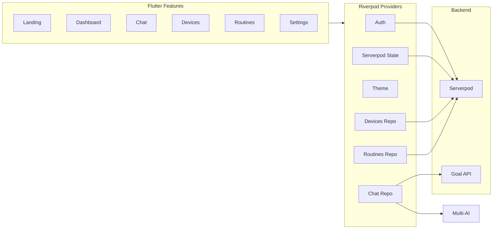
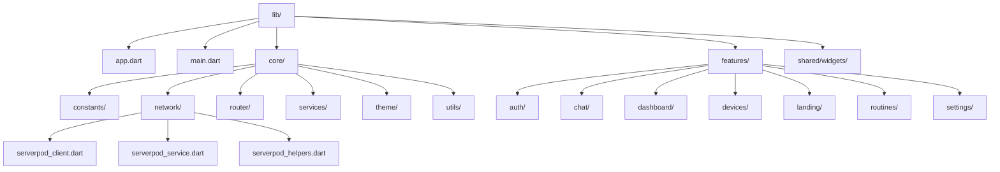

# A.U.R.A. — Flutter + Serverpod Smart Home

A.U.R.A. — a goal-oriented smart home app built with **Flutter** (web & desktop) and **Serverpod** for backend integration.

Express goals in natural language (e.g. “Set up for movie night”, “I’m cold”), and A.U.R.A. orchestrates devices. The app runs in Chrome or as a desktop client, with optional AI providers and a Serverpod backend for full functionality.

---

## Architecture Overview



---

## Flutter ↔ Serverpod Integration



---

## Feature & Data Flow



---

## Tech Stack

| Layer | Technology |
|-------|------------|
| **UI** | Flutter — responsive layout, light/dark theme, shared components (app bar, bottom nav, glass containers) |
| **State** | Riverpod — auth, chat, routines, devices, theme, Serverpod client |
| **Backend** | Serverpod — client with connection state, reconnection, and generated RPC endpoints |
| **Routing** | GoRouter — declarative routes (landing, dashboard, chat, devices, routines, settings) |
| **AI** | Multi-AI service — single API over OpenAI, Anthropic, Gemini with fallback |

---

## What It Does

- **Goal-oriented chat** — Send goals to an optional backend (`AURA_BACKEND_URL` or **Serverpod** via `SERVERPOD_URL`; see `lib/core/network/SERVERPOD_AURA_API.md`) or use local AI (OpenAI/Anthropic/Gemini) or demo mock.
- **Smart home dashboard** — Devices, routines, and status at a glance.
- **Routines** — One-tap actions (e.g. “Lock all doors”, “Dim lights”, “Set thermostat to 68°F”).
- **Devices** — Browse and manage connected devices (Serverpod or your backend).
- **Serverpod-ready** — Backend wired with Riverpod providers, connection state, retry logic, and graceful degradation when Serverpod isn’t configured.

---

## Project Structure



| Path | Purpose |
|------|---------|
| `lib/app.dart` | Root `MaterialApp.router` and theme |
| `lib/core/` | Theme, env, router, HTTP client, **Serverpod client/service/helpers**, AI services |
| `lib/features/` | Auth, chat, dashboard, devices, landing, routines, settings |
| `lib/shared/widgets/` | Reusable UI (app bar, bottom nav, glass container, loading, etc.) |

Serverpod integration details: see **`lib/core/network/SERVERPOD_INTEGRATION.md`**.

---

## Requirements

- **Flutter SDK** (>=3.2.0)
- **Dart** 3.2+
- **(Optional)** Serverpod server project and generated client for full backend features
- **(Optional)** At least one AI API key (OpenAI, Anthropic, or Gemini) for live chat; otherwise demo/mock mode

---

## Getting Started

### 1. Clone and install

```bash
git clone <your-repo-url>
cd "aura flutter"
flutter pub get
```

### 2. Run (Chrome / Web)

```bash
flutter run -d chrome
```

Or on Windows PowerShell:

```powershell
.\run_chrome.ps1
```

The app runs without any keys. Chat uses **mock responses** until you set `AURA_BACKEND_URL` or add an AI API key.

### 3. (Optional) AI providers

Set at least one API key for real AI responses:

```bash
flutter run --dart-define=OPENAI_API_KEY=your_key
# or
flutter run --dart-define=ANTHROPIC_API_KEY=your_key
# or
flutter run --dart-define=GEMINI_API_KEY=your_key
```

Or copy `dart_defines.local.example` to `dart_defines.local`, add your keys, and run with `.\run_local.ps1` (do not commit `dart_defines.local`).

### 4. (Optional) Goal API backend

To send chat goals to an external orchestrator, set:

```bash
flutter run -d chrome --dart-define=AURA_BACKEND_URL=https://your-aura-api.example.com
```

With Bearer token:

```bash
flutter run -d chrome --dart-define=AURA_BACKEND_URL=https://... --dart-define=AURA_BACKEND_TOKEN=your_jwt_or_key
```

### 5. (Optional) Serverpod backend

1. Create a Serverpod server: `serverpod create aura_server`
2. Generate the client in the server project and add it to this app’s `pubspec.yaml`.
3. Configure the client in `lib/core/network/serverpod_client.dart` (see **`SERVERPOD_INTEGRATION.md`**).
4. Set the server URL:  
   `flutter run --dart-define=SERVERPOD_URL=https://your-server.com/`

### 6. Build for production (Web)

```bash
flutter build web
```

Serve the `build/web` output with any static host. Use the same `--dart-define=AURA_BACKEND_URL=...` (and optional `AURA_BACKEND_TOKEN`) when building if you use the goal API.

---

## Demo Video & Submission

For hackathon submission, include:

- A **demo video** (e.g. up to 3 minutes) showing: chat, dashboard, routines, and (if applicable) Serverpod connection.
- A **project description** (this README summarizes the Flutter + Serverpod architecture and features).
- A **link to this repository** (public or with read access for judges as per hackathon rules).

---

## License

See repository license file.
